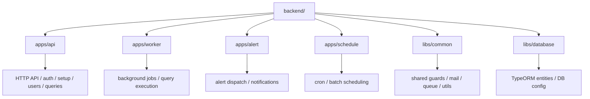
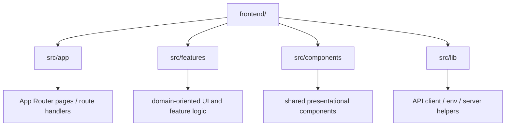
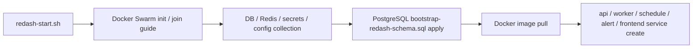

# New Redash

이 프로젝트는 `Redash 10.0.0.b50363` 버전을 기준으로 재구성한 저장소입니다.

기존 Redash와의 호환성은 다음 기준을 따릅니다.

- `dashboard`
- `chart`

위 두 영역을 제외하면, 나머지 동작과 데이터 구조는 기존 Redash와 최대한 호환되도록 설계했습니다.

## Overview

- `backend/`: NestJS 기반 API, worker, alert, schedule 앱
- `frontend/`: Next.js 기반 웹 애플리케이션
- `bootstrap-redash-schema.sql`: TypeORM 기준 RDBMS 초기 스키마 bootstrap SQL
- `redash-start.sh`: Docker Swarm 초기 배포 wizard
- `redash-delete.sh`: Docker Swarm 리소스 정리 스크립트
- `docker-push.sh`: Docker Hub 멀티아키 이미지 push 스크립트

## Backend Structure



```text
backend/
├── apps/
│   ├── api/
│   ├── worker/
│   ├── alert/
│   └── schedule/
└── libs/
    ├── common/
    └── database/
```

## Frontend Structure



```text
frontend/
└── src/
    ├── app/
    ├── features/
    ├── components/
    └── lib/
```

## Deployment Flow



## `redash-start.sh`

`redash-start.sh`는 Redash 첫 배포를 위한 대화형 wizard입니다.

주요 기능:

- 한글 / English 언어 선택
- Docker Swarm bootstrap 안내
- PostgreSQL / Redis를 외부 서비스 또는 Docker Swarm으로 선택
- Swagger, Base URL, JWT secret, Redash secret, mail 설정 수집
- Docker config / Docker secret 생성
- `bootstrap-redash-schema.sql` 자동 적용
- `backend-api`, `backend-worker`, `backend-schedule`, `backend-alert`, `frontend` 서비스 배포

사용 예시:

```bash
./redash-start.sh
```

미리보기:

```bash
./redash-start.sh --dry-run
```

참고:

- 같은 `Setup ID`를 재사용하면 기존 이름의 service / secret / config를 교체하고 network / volume은 재사용합니다.
- Docker Swarm manager 노드에서 실행해야 합니다.

## `redash-delete.sh`

`redash-delete.sh`는 `redash-start.sh`가 생성한 Docker Swarm 리소스를 제거하는 정리 스크립트입니다.

삭제 대상:

- services
- secrets
- configs
- overlay networks
- named volumes
- `.redash-setup/` 아래 생성된 파일

사용 예시:

```bash
./redash-delete.sh
```

특정 `setup id`만 삭제:

```bash
./redash-delete.sh main
```

전체 삭제:

```bash
./redash-delete.sh --all
```

주의:

- 실행 전 최종 확인을 요구합니다.
- 삭제는 복구되지 않습니다.

## Database Support

현재 데이터베이스 지원 범위는 `TypeORM` 기준의 `RDBMS` 구조에 맞춰져 있습니다.

- PostgreSQL 중심 운영을 기본 전제로 둡니다.
- 초기 스키마는 [bootstrap-redash-schema.sql](/Users/gornoba/Downloads/redash-10.1.0/new-redash/bootstrap-redash-schema.sql)로 생성합니다.
- NoSQL, 비-PostgreSQL 계열 특화 기능, 추가 드라이버 지원은 아직 범위에 포함하지 않았습니다.

추가로 필요한 기능, 다른 데이터베이스 지원, 운영 개선 포인트가 있다면 issue 또는 pull request를 부탁드립니다.

## Contributing

기능 제안, 버그 리포트, 호환성 개선, 운영 자동화 개선 PR을 환영합니다.

- issue: 요구사항, 환경, 재현 절차를 함께 남겨주세요.
- pull request: 변경 배경, 영향 범위, 검증 방법을 같이 적어주세요.

## License

MIT
